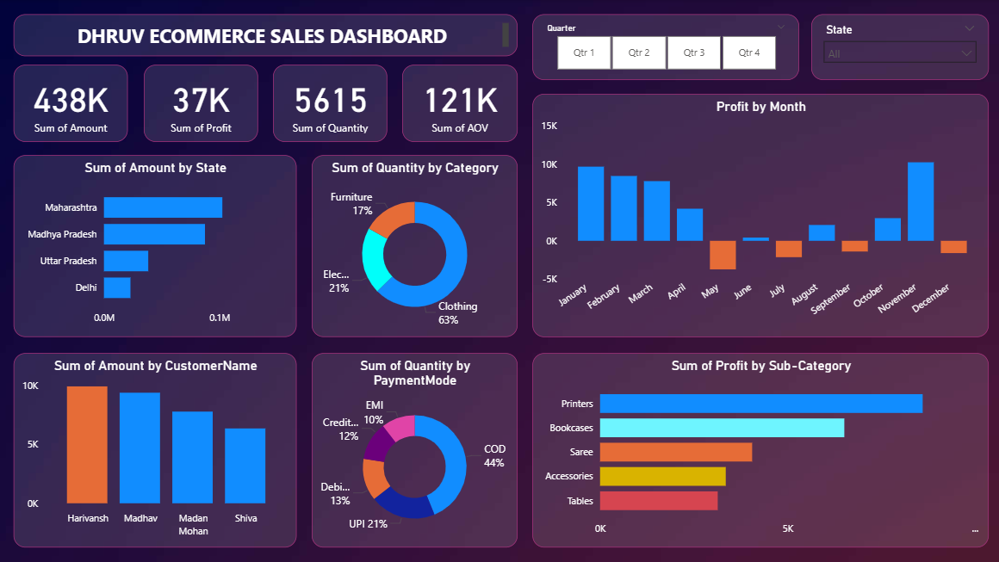

# 📊 Power BI Project – Customer & Order Insights Dashboard

## 🔍 Overview
This Power BI dashboard provides detailed insights into customer behavior, order trends, and sales performance using data from two datasets: `DAX Customers` and `DAX Orders`. It is designed to help businesses understand key performance metrics such as customer distribution, order frequency, and sales contribution by region, customer, and time.

## 📁 Files Included
- `Project Power BI.pbix` – The main Power BI report file
- `DAX Customers.xlsx` – Contains customer details such as ID, name, region, and demographics
- `DAX Orders.xlsx` – Contains order transactions, including product info, quantity, price, and customer ID

## 💡 Features
- 📌 Interactive dashboard with slicers for region, customer name, and date
- 📈 Trend analysis of total orders and revenue over time
- 🧮 KPIs such as Total Orders, Total Sales, and Average Order Value
- 📊 Visuals showing:
  - Region-wise customer distribution
  - Top 10 customers by revenue
  - Order frequency per customer
  - Monthly order trends

## 🛠️ How to Use
1. Download all files from this repository.
2. Open `Project Power BI.pbix` in **Power BI Desktop**.
3. When prompted, update the data source paths to match the location of the `DAX Customers.xlsx` and `DAX Orders.xlsx` files on your system.
4. Click **Refresh** to load the latest data.

## 🖼️ Dashboard Preview
You can include a screenshot here:
```markdown



